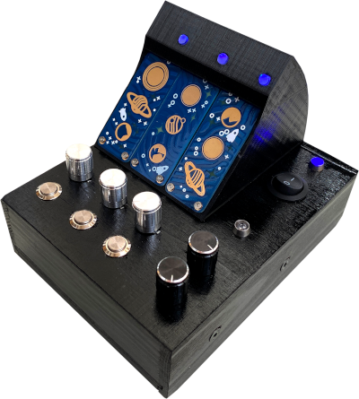
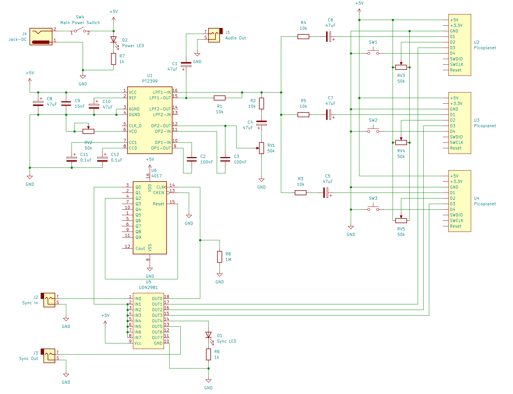

# Interplanetary Synth

This is a DIY synthesizer project based on Bleeptrack's [Picoplanets](https://github.com/bleeptrack/picoplanet).

Features:
- 3 voices polyphonic synthesis, based on PWM
- Recording and looped playback of sequences
- Pitch control
- PT2399 echo/reverb unit
- Sync in/out jacks on order to sync the Interplanetary Synth with other analog synthesizers

LEDs:
- Blue: live mode, synth plays what is currently played on the touch buttons
- Red: recording of what is currently played on the touch buttons
- Green: playback of recorded frequencies
- Purple: waiting for next rising edge of sync signal to restart playback

Here is a demo of how to use the Interplanetary Synth and how it sounds: https://www.youtube.com/watch?v=XGoNoBU3fJs

# Circuit Diagram

The circuit consists of
- Three Picoplanets,
- an Echo/Reverb unit (inspired by Peter Vis' https://www.petervis.com/guitar-circuits/pt2399/testing-and-troubleshooting.html but with important changes on Pins 2, 3 and 4 according to https://www.petervis.com/guitar-circuits/pt2399/basic-echo-circuit.html) and
- a unit to handle Sync signals using a CD4017 (frequency divider) and a UDN2981 (driver)

The four usable Pins of the Picoplanets work as PWM-Output, Potentiometer-Input, Push-Button-Input and Sync-Signal-Input.

# Case

I used a simple wooden box for housing everything except the Picoplanets. In order to get them up to face the user at an angle of 45° I designed and printed a special top-case. Find the model in the folder '3dmodels'.

In order to the make the LEDs visible I drilled additional 5mm holes in it (forgot about that beforehand) and pressed small pieces of 5mm fibre optic cable (https://amzn.to/3QgvRLP) into them. This work surprisingly well, the light of the small LED appears really great at the end of the fibre cables.
