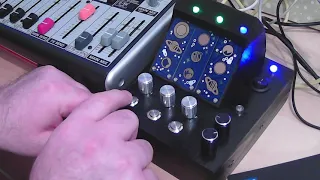

# Interplanetary Synth

This is a DIY synthesizer project based on Bleeptrack's [Picoplanets](https://github.com/bleeptrack/Picoplanet).

Features:
- 3 voices, polyphonic, based on PWM
- Recording and looped playback of sequences
- Pitch control
- PT2399-based echo/reverb unit
- Sync in/out jacks in order to sync the Interplanetary Synth with other analog synthesizers

After turning the synth on all three voices start in live-mode. When pressing and holding the button, the Picoplanet starts recording what is currently played. After releasing the button the Picoplanet immediately plays what was recorded. Looping starts with the next rising sync edge (after frequency dividing, see circuit). When pressing the button quickly (without touching any touch buttons) the Picoplanet returns into live-mode.

I am sure the software can be improved in several ways. Find the code.py right here in the root directory.

LEDs:
- Blue: live-mode, synth outputs what is currently played on the touch buttons
- Red: recording of what is currently played on the touch buttons
- Green: playback of recorded frequencies
- Purple: waiting for next rising edge of sync signal to restart playback

Here is a demo of how to use the Interplanetary Synth and how it sounds: https://www.youtube.com/watch?v=XGoNoBU3fJs

# Circuit Diagram

I hope that I have reproduced everything correctly in the circuit diagram. Use at your own risk.

The circuit consists of
- three Picoplanets,
- an Echo/Reverb unit (inspired by Peter Vis' https://www.petervis.com/guitar-circuits/pt2399/testing-and-troubleshooting.html but with important changes on Pins 2, 3 and 4 according to https://www.petervis.com/guitar-circuits/pt2399/basic-echo-circuit.html) and
- a unit to handle Sync signals using a CD4017 (frequency divider) and a UDN2981 (driver)

The four usable Pins of the Picoplanets work as PWM-Output, Potentiometer-Input, Push-Button-Input and Sync-Signal-Input.

# Case

I used a simple wooden box (https://amzn.to/3G5dJ2B) for housing everything except the Picoplanets and I painted it black. In order to get them up at a 45° angle to the user, I designed and printed a special top-case. Find the model in the folder '3dmodels'.

To make the LEDs visible, I drilled additional 5mm holes in the top case (I had forgotten to do this before) and pressed small pieces of 5mm fibre optic cable (https://amzn.to/3QgvRLP) into them. This worked surprisingly well. The light of the small LED appears really great at the end of the fibre cables.
